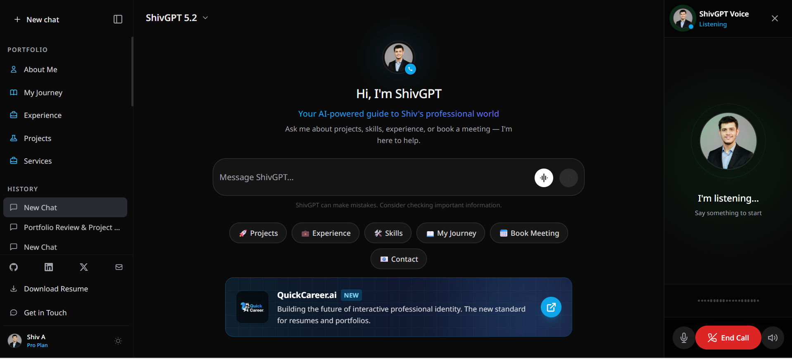
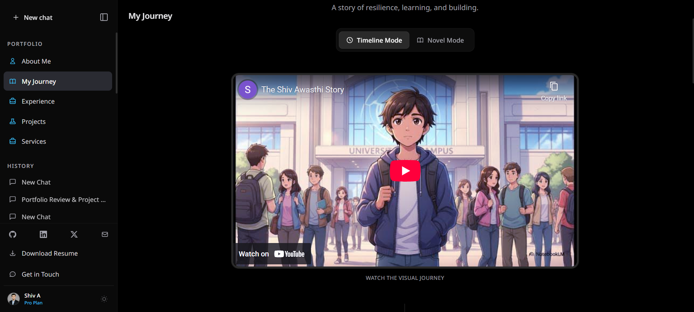
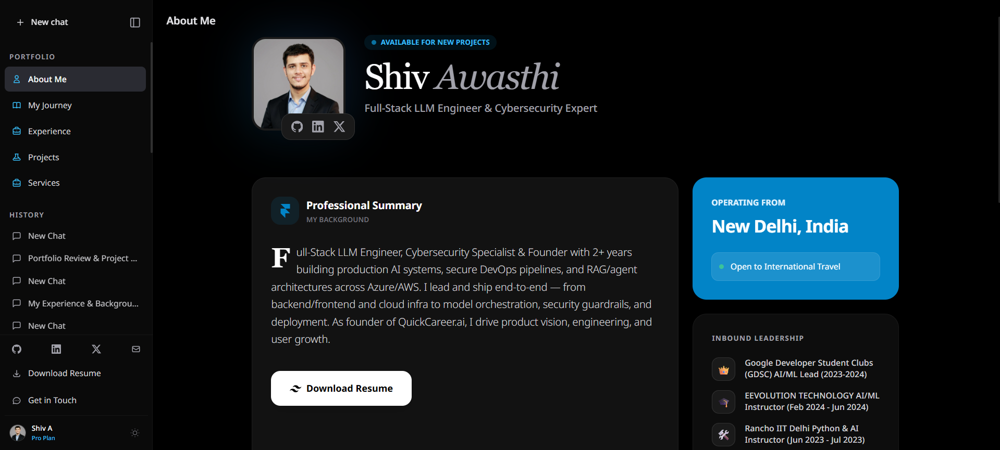

# ⚡ PortfolioGPT

### The Ultimate AI-Powered Portfolio Template for Developers

<div align="center">

[](LICENSE)
[](https://www.typescriptlang.org/)
[](https://reactjs.org/)
[](https://vitejs.dev/)
[](https://tailwindcss.com/)
[](https://deepmind.google/technologies/gemini/)

</div>

<br />

<div align="center">
  <video src="public/Readme_stuff/AI%20Portfolio.mp4" controls="controls" width="100%" style="border-radius: 10px; box-shadow: 0 4px 12px rgba(0,0,0,0.1);"></video>
  <p><em>(If video doesn't play, <a href="public/Readme_stuff/AI%20Portfolio.mp4">download it here</a>)</em></p>
</div>

---

---

## 💡 What is PortfolioGPT?

**PortfolioGPT** isn't just a resume—it's a **living, breathing AI agent** that represents you 24/7. 

Instead of reading static text, recruiters and clients can **chat** with your professional persona, ask about your skills, and even book meetings directly through the interface. Built with the latest tech stack, it's designed to be the **last portfolio template you'll ever need**.

## ✨ Key Features

| Feature | Description |
| :--- | :--- |
| **🧠 Contextual AI** | Powered by **Google Gemini 1.5 Flash**, it understands your resume and answers questions intelligently. |
| **🎙️ Voice Mode** | Full duplex voice conversations. Talk to the portfolio like a real person. |
| **🎨 Premium UI/UX** | Glassmorphism design, smooth Framer Motion animations, and fully responsive layout. |
| **⚡ Blazing Fast** | Built on **Vite** and **React 19** for instant load times and SEO optimization. |
| **📧 Smart Contact** | Integrated **Resend** email service with serverless security (no exposed API keys). |
| **🛠️ 100% Configurable** | Update **one file** (`constants.ts`) to completely customize the content. |
| **📢 Dynamic Banner** | Configurable toggleable banner for announcements or promotions. |
| **🎛️ Feature Flags** | Enable/disable entire sections (Projects, Experience) via `.env` flags. |
| **📱 Mobile First** | Fully responsive design that looks great on all devices. |
| **📅 Scheduling** | Built-in **Calendly** integration for seamless booking. |

---

## 📸 Interface Preview

<div align="center">
  <h3>Main Dashboard</h3>
  
</div>

<br />

<div align="center">
  <h3>Interactive Story & About Sections</h3>
  
  
</div>


---

## 🛠️ Tech Stack

-   **Core:** React 19, TypeScript, Vite
-   **Styling:** Tailwind CSS, Lucide React
-   **Animations:** Framer Motion
-   **AI Engine:** Google Gemini API (`@google/genai`) / OpenAI (Optional)
-   **Email:** Resend (Serverless)
-   **Deployment:** Vercel

---

## 🚀 Quick Start

Get your AI portfolio running in less than 5 minutes.

### 1. Prerequisites
-   Node.js 18+ or Bun 1.0+
-   [Google Gemini API Key](https://aistudio.google.com/) (Free tier available)
-   [Resend API Key](https://resend.com/) (For emails)

### 2. Installation

```bash
# Clone the repo
git clone https://github.com/shivatmax/PortfolioGPT.git
cd PortfolioGPT

# Install dependencies
npm install  # or bun install
```

### 3. Configuration

Create a `.env` file in the root directory:

```env
# Required
VITE_GEMINI_API_KEY=your_gemini_key
VITE_RESEND_API_KEY=your_resend_key

# Optional (for OpenAI fallback)
VITE_OPENAI_API_KEY=sk-...    

# Branding
VITE_SITE_NAME="AlexGPT"
VITE_SITE_URL="https://alex.dev"
```

### 4. Run It 🏃‍♂️

```bash
npm run dev
```

Visit `http://localhost:3000` to see your new portfolio!

---

## 🎨 Customization Guide

We believe in **"Config over Code"**. You don't need to be a React expert to make this yours.

### 1. Update Content
Open `constants.ts`. This file is the **brain** of your application.
-   **`PROFILE`**: Your bio, social links, and "system prompt" context.
-   **`EXPERIENCE` / `PROJECTS`**: Arrays of your work history.
-   **`CONFIG`**: Feature flags to toggle sections (e.g., `showBanner: false`).

### 2. Add Assets
Drop your resume and images into the `public/` folder.
-   `public/resume.pdf` → Update `PROFILE.resumeUrl`
-   `public/avatar.jpg` → Update `UI_TEXT.sidebar.avatar`

---

## ☁️ Deployment

Deploy for **free** on Vercel with zero configuration.

[](https://vercel.com/new/clone?repository-url=https%3A%2F%2Fgithub.com%2Fshivatmax%2FPortfolioGPT)

1.  Push your code to GitHub.
2.  Import project to Vercel.
3.  Add your **Environment Variables** in Vercel settings.
4.  **Done!** Your site is live.

---

## 🤝 Contributing

We love contributions! If you have ideas for new features (like more AI models, themes, or integrations):

1.  Fork the Project
2.  Create your Feature Branch (`git checkout -b feature/AmazingFeature`)
3.  Commit your Changes (`git commit -m 'Add some AmazingFeature'`)
4.  Push to the Branch (`git push origin feature/AmazingFeature`)
5.  Open a Pull Request

---

## 📄 License

Distributed under the MIT License. See `LICENSE` for more information.

<div align="center">
  <br />
  <sub>Built with ❤️ by <a href="https://github.com/shivatmax">Shiv Awasthi</a></sub>
</div>
